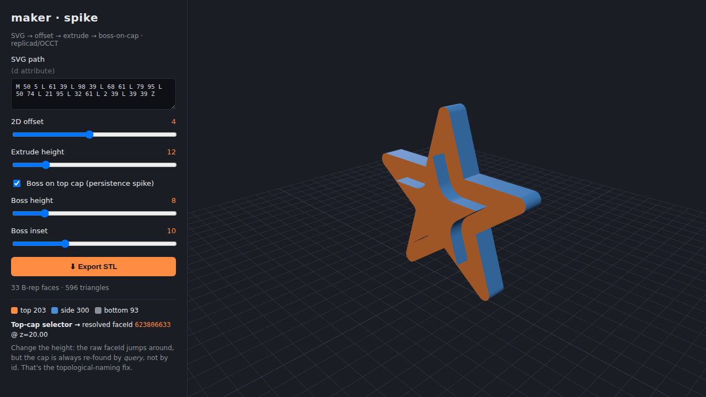

# maker · spike + PoC SVG

A de-risking spike for a **nodal parametric 3D generator** (à destination de
l'impression 3D). It proves the risky parts of the stack end-to-end before
committing to the full build.



## What this proves

1. **SVG pipeline** — an SVG `<path d="…">` is parsed and turned into a 2D
   profile, offset in 2D, then extruded to a solid. (`svgInput → offset2d →
   extrude`)
2. **Extrude on the result of an extrude, taking the cap** — a boss is built on
   the top face of the first extrude. (`bossOnCap`)
3. **Face flagging / persistence (the hard part)** — faces are tagged
   `top` / `side` / `bottom`, and the top cap is re-selected across
   regenerations by a **criteria-based query, not a stored id**. This is the
   answer to the *topological naming problem*: raw face ids are unstable, so we
   store the query and re-resolve it every rebuild.
4. **STL export** — watertight output for 3D printing.

The geometry runs on **replicad** (a TypeScript wrapper over **OpenCascade /
OCCT**, a real B-rep CAD kernel compiled to WASM). The viewport is **Three.js**.

## The stack, confirmed

| Concern | Choice | Status |
|---|---|---|
| B-rep kernel (offset, extrude, face selection) | replicad + `replicad-opencascadejs` | ✅ works |
| Off-thread compute | Web Worker + comlink | ✅ works |
| Viewport | Three.js (reuses the parent repo's viewport patterns) | ✅ works |
| SVG path → profile | custom parser (`src/kernel/svgPath.ts`) | ✅ works |
| STL export | `solid.blobSTL()` | ✅ works |

## Run it

```bash
cd maker
npm install

# 1. Headless proof of the geometry (no browser needed)
npm run smoke

# 2. Interactive PoC in the browser
npm run dev        # then open the printed URL
```

`npm run smoke` output (abridged):

```
PoC SVG pipeline: svgInput → offset2d → extrude → bossOnCap
  B-rep faces         : 33
  resolved top cap    : faceId=623811297 @ z=20.00
Persistence spike — regenerate with different heights:
  height= 6  topCapFaceId=759330689  z=14.00  (expected≈14)  ✓
  height=12  topCapFaceId=921844289  z=20.00  (expected≈20)  ✓
  height=30  topCapFaceId=1051123585 z=38.00  (expected≈38)  ✓
  → selector stayed correct across 3 regenerations
STL export: 742824 bytes  ✅
```

Note how the raw `faceId` changes every regeneration while the selector keeps
resolving the correct cap — that's the whole point.

## Architecture (as spiked)

```
UI (React)                     ← this PoC hardcodes the graph; React Flow later
  │  Params
  ▼
Web Worker (comlink)
  │  evalGraph(): tiny typed DAG  → src/kernel/nodes.ts
  │    nodes: svgInput · offset2d · extrude · bossOnCap
  │    typed wires: sketch2d | solid
  ▼
replicad / OCCT (WASM)  → meshAndTag() → { vertices, indices, normals, groups[tag] }
  ▼
Three.js viewport  (one material per tag)
```

Key files:

- `src/kernel/nodes.ts` — the typed node-graph engine + geometry nodes + face
  tagging + the criteria-based `resolveTopCap` selector.
- `src/kernel/svgPath.ts` — SVG path → replicad drawing (the future "text → SVG"
  node plugs in here).
- `src/kernel/model.ts` — wires the default graph from user params.
- `src/kernel/worker.ts` / `client.ts` — OCCT worker + comlink bridge.
- `scripts/smoke.ts` — headless proof.

## Known limits (deliberately out of scope for the spike)

- SVG parser handles `M L H V C Q Z` and the **first** closed subpath only —
  holes (letters like O/A) are TODO.
- **Mesh domain not included yet.** The full tool also needs STL *import* +
  editing (booleans, repair). That's a second kernel (**Manifold**, WASM) living
  next to OCCT, with a one-way `B-rep → mesh` bridge (tessellate) and mesh-domain
  face flagging via triangle-region segmentation. Not spiked here.
- The graph is hardcoded; the real editor is **React Flow** over this same
  `nodes.ts` engine.

## Next steps

1. React Flow editor on top of `nodes.ts` (node palette, typed ports, live eval).
2. Add the **Manifold** mesh kernel + STL import/boolean/repair nodes and the
   tessellate bridge.
3. `text → SVG` node via **opentype.js** glyph paths (feeds `svgPath.ts`).
4. Per-node caching so only the sub-graph downstream of a changed param recomputes.
