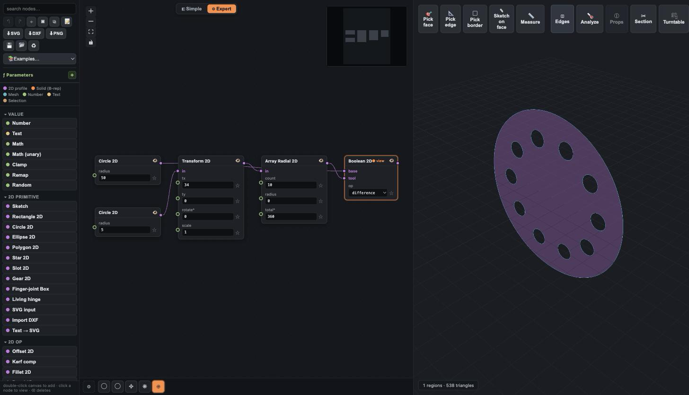

# nodal-maker

**A node-based parametric CAD/CAM tool that runs entirely in the browser** — built for
**resin 3D printing** and **laser / Cricut cutting**. Wire nodes into a graph
(Fusion360-meets-Blender), tweak parameters, and get live B-rep solids and 2D profiles you
can export to STL / STEP / 3MF / SVG / DXF.

🔗 **Live:** https://tibus.github.io/nodal-maker/
📐 **How it works:** [`docs/ARCHITECTURE.md`](./docs/ARCHITECTURE.md)



---

## What it does

- **Node graph** — a typed DAG of ~80 nodes. Wires carry typed values (2D profile · solid ·
  mesh · number · text · selection); the socket colours tell you what plugs into what.
- **Two geometry kernels, in a Web Worker** — [replicad](https://replicad.xyz) /
  OpenCascade for **exact B-rep** modelling (extrude, revolve, loft, fillet, shell, boolean,
  threads, STEP export) and [Manifold](https://github.com/elalish/manifold) for **robust
  mesh** work (booleans, hulls, gyroid infill, collision).
- **2D constraint sketcher** — points/lines/arcs with coincidence, parallel, tangent,
  dimensions… solved live with Levenberg–Marquardt. Sketch on a base plane *or an arbitrary
  picked face*.
- **Simple / Expert modes** — Expert is the full node graph; **Simple** is an auto-generated
  form (thumbnail gallery + only the parameters the author exposed) so a non-technical user
  just tweaks values and watches the model update. No nodes required.
- **Live picking** — click a face/edge in the viewport to auto-wire a selection node;
  face selections survive regeneration (they're stored as *criteria*, not fragile ids — the
  topological-naming problem, solved).

## Feature highlights

| Domain | What you get |
|---|---|
| **Resin printing** | hollow + drain holes, infill lattice, **gyroid** infill, auto-orient, support generation, split-for-build-plate, overhang & wall-thickness analysis, watertight check, resin cost/time estimate |
| **Laser / Cricut** | living hinge, nesting, dogbone/T-bone corners, hold-in-sheet tabs, kerf compensation, finger-joint boxes, CUT/SCORE DXF layers, SVG & DXF import/export |
| **Modelling** | extrude (taper/twist), pocket, parametric holes, revolve, loft, sweep, boss-on-cap, variable-radius fillet, chamfer, shell, patterns (linear/radial/**path**), text engrave/emboss on a face |
| **Analysis & viewport** | section view, measure tool, mass properties, per-body colour, turntable video export |
| **Import/export** | STL, STEP, 3MF, SVG, DXF, PNG, WebM |

## Quick start

```bash
npm install
npm run dev          # interactive editor — open the printed URL
```

```bash
npm run build        # typecheck + production build
npm test             # Vitest suite (58 tests: kernel eval, expr, solver, exports…)
npm run thumbs:examples   # (re)generate missing example thumbnails (WebGL screenshots)
```

Headless smoke tests (no browser): `npm run smoke`, `npm run smoke:sketch`,
`npm run smoke:mesh`, `npm run scenes`.

## Tech stack

TypeScript (strict, ESM) · React 18 + [React Flow](https://reactflow.dev) · Three.js ·
replicad/OpenCascade (WASM) · Manifold (WASM) · comlink · Vite · Vitest · Playwright.
No backend — a fully static SPA, deployed to GitHub Pages on every push to `main`
(the test suite gates the deploy).

## Project layout

```
src/kernel/    the graph engine (nodes.ts), the worker, both kernel wrappers, exporters
src/sketch/    the framework-free 2D constraint sketcher (model · solver · build)
src/           App, NodeEditor (React Flow), SketchEditor, viewport (Three.js)
examples/      55 bundled example projects        public/thumbs/  their preview PNGs
scripts/       thumbnail & scene generation, smoke tests
test/          the Vitest suite
```

See [`docs/ARCHITECTURE.md`](./docs/ARCHITECTURE.md) for the full tour: the data flow,
the evaluation cache, the constraint solver, the viewport, the configurator, and **how to
add a node in 4 edits**.

## Status

Well past the original de-risking spike — this is a working tool with a live deployment,
a broad node library, the Simple/Expert configurator, a real test suite, and CI/CD. It
remains a solo project and a moving target; expect rough edges and see the *Design
decisions & known limits* section of the architecture doc.
