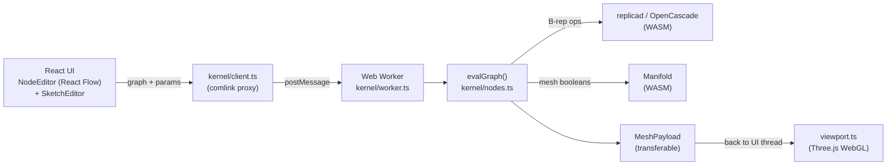

# nodal-maker — Architecture & how it works

A node-based parametric CAD/CAM tool for the browser, aimed at **resin 3D printing**
and **laser / Cricut cutting**. You wire nodes into a graph (Fusion360-meets-Blender),
tweak parameters, and get live B-rep solids and 2D profiles you can export to
STL / STEP / 3MF / SVG / DXF.

This document is the ground-truth tour of the codebase: the moving parts, the data
flow, the two geometry kernels, the constraint solver, the viewport, and the build/
deploy/test pipeline. It's meant to get a new contributor productive fast.

---

## 1. TL;DR — the shape of the thing



- **Everything geometric runs in a Web Worker** so the UI never blocks on OpenCascade.
- **Two geometry kernels** live side by side: **replicad** (OpenCascade / B-rep, exact)
  for most modelling, and **Manifold** (guaranteed-manifold mesh) for robust booleans,
  hulls, gyroid infill, etc.
- The graph is **content-addressed cached**: change one parameter and only that node
  and its descendants re-evaluate.
- The 2D **constraint sketcher** is a small framework-free module shared by the UI and
  the kernel, solved with **Levenberg–Marquardt**.

---

## 2. Tech stack

| Layer | Choice |
|---|---|
| Language | TypeScript (strict, ESM) |
| UI | React 18 + [@xyflow/react](https://reactflow.dev) (React Flow) for the node canvas |
| 3D viewport | Three.js (WebGLRenderer, OrbitControls, TransformControls) |
| B-rep kernel | [replicad](https://replicad.xyz) → OpenCascade.js (WASM) |
| Mesh kernel | [Manifold](https://github.com/elalish/manifold) (WASM) |
| Worker bridge | [comlink](https://github.com/GoogleChromeLabs/comlink) |
| Fonts / text | opentype.js |
| Build | Vite |
| Tests | Vitest |
| Thumbnails | Playwright (headless WebGL screenshot) |
| Deploy | GitHub Actions → GitHub Pages |

No backend — it's a fully static SPA. Both WASM kernels load lazily inside the worker.

---

## 3. Directory map

```
src/
  main.tsx              entry; mounts <App> (or the thumbnail harness on ?thumbs)
  App.tsx               top-level shell: viewport + toolbar + panels, wires UI↔worker
  NodeEditor.tsx        the React Flow node canvas, palette, Simple/Expert modes
  SketchEditor.tsx      the 2D constraint sketch overlay
  ThumbHarness.tsx      off-app harness that renders one example → PNG (for thumbnails)
  viewport.ts           Three.js scene: shading, picking, gizmos, clipping, analysis
  massprops.ts          volume / area / bbox / centroid + watertight check (pure JS)
  export3mf.ts          minimal 3MF (OPC/ZIP) writer

  kernel/
    client.ts           comlink proxy to the worker + re-exported metadata
    worker.ts           the Web Worker: boots both WASM kernels, exposes the API
    nodes.ts            ★ the heart: node REGISTRY, GraphValue types, evalGraph, cache
    specs.ts            UI-facing metadata: NODE_SPECS, categories, socket colours (no WASM)
    model.ts            graph → renderable MeshPayload; SVG/DXF exporters
    manifold.ts         Manifold wrapper: mesh booleans, hull, minkowski, decimate…
    components.ts       node "components" (reusable sub-graphs) expansion
    expr.ts             the expression evaluator (parameters like `width/2 + 4`)
    marchingCubes.ts    isosurface extraction (used by the gyroid infill)
    dxfImport.ts        minimal DXF reader → replicad Drawing
    svgPath.ts          SVG path `d` → replicad Drawing
    stl.ts              binary STL read/write

  sketch/               the 2D constraint sketcher (framework-free, shared UI↔kernel)
    model.ts            SketchDoc data model (points, entities, constraints)
    solver.ts           Levenberg–Marquardt constraint solver
    build.ts            solved SketchDoc → replicad Drawing
    geometry.ts         2D geometry helpers
    trim.ts             trim / split / fillet-corner editing ops
    presets.ts          starter documents (rectangle, plate-with-hole, …)

scripts/                build-time tooling (thumbnails, scene generation, smoke tests)
test/                   Vitest suite (kernel eval, expr, mass props, solver, exports…)
examples/*.json         55 bundled example projects (SceneDoc format)
public/thumbs/*.png     one WebGL-rendered thumbnail per example
```

---

## 4. The node graph — core concepts

Everything the user builds is a **graph of typed nodes**. This lives in `kernel/nodes.ts`.

### 4.1 Values flow on the wires (typed)

Wires carry a `GraphValue`, a tagged union:

```ts
type GraphValue =
  | { kind: "sketch2d"; drawing: Drawing; plane?; planeOffset?; frame? }  // 2D profile (purple)
  | { kind: "solid";    solid: Shape3D; color? }                          // B-rep solid (orange→gray)
  | { kind: "mesh";     mesh: MeshData }                                   // triangle mesh (cyan)
  | { kind: "number";   value: number }                                   // scalar (green)
  | { kind: "text";     value: string }                                   // string (yellow)
  | { kind: "selection"; target: "edge" | "face"; apply: (finder) => … }  // criteria (amber)
```

The socket **colours** in the palette and on ports come straight from these kinds
(`SOCKET_COLORS` in `specs.ts`) — a node's output dot tells you which inputs it can feed.

### 4.2 Two parallel tables

- **`NODE_SPECS`** (`specs.ts`) — pure metadata: label, inputs, output type, params.
  Imported by the **UI** with *no WASM dependency* (keeps the UI bundle light).
- **`REGISTRY`** (`nodes.ts`) — the implementations: `(inputs, params) => GraphValue`.
  Imported by the **worker**, where OpenCascade/Manifold are available.

Adding a node = one entry in each (plus a category + description). See §12.

### 4.3 Evaluation — topological, memoised, content-addressed

`evalGraph(graph, vars)` walks the DAG lazily from the requested output:

1. `resolveRef` pulls each input value (recursing into upstream nodes, memoised per run).
2. `resolveInputs` merges wired inputs over params, coercing **numeric params that are
   expressions** (e.g. `"width/2"`) via `expr.ts` and the user-parameter `vars` map.
3. The node's `REGISTRY` impl runs; failures are wrapped by **`humanizeError`** (turns
   cryptic OpenCascade aborts into "fillet radius too large", etc.) and tagged with the
   node id so the editor can highlight it.

**Incremental cache** (`evalGraphCached`, `EvalCache`): each node gets a **content hash**
(`fnv1a` of `type + params + the hashes of its inputs` + the user-vars key). Change one
parameter and only that node's hash — and its descendants' — change; everything else is
served from cache. A `run` counter drives a retention window so stale entries are dropped.

### 4.4 Selections (face / edge) survive regeneration

Fillet/shell/bevel don't store face indices (which change when geometry regenerates).
Instead a **Face/Edge Select** node emits a `selection` value: a *criteria closure*
(`inPlane`, `parallelTo`, `top`, `cylindrical`, …) applied to whatever solid the
downstream op receives. `forwardCrit` even re-maps a selection through a transform so a
"top face" stays the top face after a move. This is what makes picking-in-the-viewport
→ auto-wire a Face Select node work.

### 4.5 Expressions & user parameters (`expr.ts`)

A tiny recursive-descent evaluator (no `eval`) with a term→unary→power grammar so
`-2^2 = -4`. Supports `+ - * / ^ %`, functions (`sqrt`, `sin/cos`, `sind/cosd`, `min`,
`max`, `hypot`, `atan2`, …) and constants (`pi`, `tau`, `e`). Global **user parameters**
(the `ƒ` panel) resolve in order into a `vars` map that any numeric field can reference.

---

## 5. The two geometry kernels

Both boot lazily inside the worker (`worker.ts` → `ensureKernels()`); the UI thread
never touches WASM.

### 5.1 replicad / OpenCascade — the B-rep kernel (exact)

Most modelling is **boundary-representation** (exact NURBS/analytic surfaces): box,
cylinder, extrude, revolve, loft, sweep, fillet, chamfer, shell, pocket, hole, boolean,
thread… `nodes.ts` calls replicad's fluent API (`draw…`, `sketchOnPlane`, `.extrude`,
`.fuse/.cut/.intersect`, `.fillet`, `.shell`). B-rep is what makes STEP export and clean
edges possible. Meshing for display happens via `meshAndTag()` (→ `MeshPayload`), which
also tags each triangle group as `top/side/bottom` (used for picking).

### 5.2 Manifold — the mesh kernel (robust)

When exactness isn't needed but **robustness** is, geometry drops to `MeshData`
(`{vertices, indices}`) and uses Manifold (`kernel/manifold.ts`): mesh booleans
(guaranteed-manifold, no OCCT boolean fragility), convex hull, Minkowski sum, decimate,
subdivide, and the **collision** and **gyroid** nodes. `solidToMeshData` / `meshToSolid`
bridge the two domains.

### 5.3 The Web Worker boundary

`client.ts` wraps the worker with comlink so the UI calls `kernel.evalGraph(...)` as if
local. `MeshPayload` is built from transferable typed arrays. The same `nodes.ts` runs in
Node for **tests** and **scene/thumbnail scripts** (they call `setOC`/`setManifold`
manually, mirroring `ensureKernels`).

---

## 6. The 2D constraint sketcher (`src/sketch/`)

A self-contained, framework-free module (no React, no replicad) so the exact same code
runs in the UI overlay and in the kernel.

- **`model.ts`** — `SketchDoc`: `points`, `entities` (line / arc / circle), `constraints`
  (coincident, horizontal, vertical, parallel, perpendicular, equal, tangent, pointOn,
  midpoint, symmetric, fixed) and **dimensions** (distance / radius / angle) that carry a
  driving value. Also a base `plane` (XY/XZ/YZ) + offset, or an arbitrary `frame`
  (origin/normal/xDir) for *sketch-on-a-tilted-face*.
- **`solver.ts`** — minimises ‖r(x)‖² over the free coordinates (point x/y + circle radii)
  with **Levenberg–Marquardt**, a **numerical Jacobian**, and a small dense linear solve.
  Sketches are tiny so this is instant. Pins (fixed points) and dimension **overrides**
  (from node params) feed in here, which is how editing a dimension re-solves live.
- **`build.ts`** — turns a *solved* doc into a replicad `Drawing` (the profile that
  extrude/pocket/revolve consume).
- **`trim.ts`** — interactive edits: trim, split-at-click, fillet-corner (tangent arc).

The `sketch` node stores its `SketchDoc` in params, mirrors each dimension as an editable
node field, and re-solves on every change.

---

## 7. The viewport (`viewport.ts`, Three.js)

One `WebGLRenderer` (antialias, `preserveDrawingBuffer` for snapshots, `localClipping`).

- **Shading** — a single neutral **gray** body material (Fusion look); the mesh is split
  into `top/side/bottom` geometry groups only so **picking** can identify faces. A **Color**
  node can override the whole-body tint. A 2D sketch renders as a **flat filled face**
  (double-sided, translucent purple) + its outline — no fake thickness.
- **View modes** — shaded / **edges** (default: shaded + real B-rep construction edges) /
  wireframe.
- **Picking** — raycasts for `pickFace`, `pickEdge`, `pickBorder`, `pickFacePlane`
  (arbitrary tilted plane), `pickPoint` (for the Measure tool). A hit auto-wires the
  matching Face/Edge Select node.
- **Gizmos** — TransformControls bound to a Transform/Rotate/Scale node writes back to its
  params live.
- **Analysis overlays** — per-vertex vertex-colour passes for **overhang** (down-faces
  steeper than an angle) and **wall thickness** (inward raycast to the far wall).
- **Section** — a clipping plane along an axis.
- **Measure** — persistent distance annotations (line + endpoint markers + a canvas-sprite
  label).
- **Turntable** — records a WebM by spinning the camera and pushing frames via
  `captureStream` + `MediaRecorder`.

---

## 8. The UI (`NodeEditor.tsx`, `App.tsx`)

- **`App.tsx`** — the shell: mounts the viewport, debounces graph changes into
  `kernel.evalGraph`, pushes the resulting `MeshPayload` into the viewport, and hosts the
  toolbar (pick modes, view mode, Analyze, Props, Section, Turntable) + the Props panel
  (volume/area/bbox/centroid, **watertight** check, resin cost/time estimate).
- **`NodeEditor.tsx`** — the React Flow canvas: palette (categorised, colour-dotted by
  output type), node bodies with inline param fields, the selection-outputs accordion,
  the history timeline, quick-add, components (collapse a selection into a reusable
  sub-graph), and persistence to `localStorage`.

### 8.1 Simple / Expert modes (the configurator)

Two tabs sit over the editor:

- **Expert** = the full node graph. Each param has a `☆` to **expose** it.
- **Simple** = a clean form: a **thumbnail gallery** of examples + only the exposed
  params (+ global `ƒ` parameters), rendered with the very same `ParamField` controls, so
  a non-node user just tweaks values and watches the model update. Exposed params +
  user params travel *inside the saved graph* and inside example files, so an author
  defines the Simple form for their model. Simple is the **default** view.

---

## 9. Feature catalogue (node categories)

| Category | Nodes (selection) |
|---|---|
| **Value** | number, text, math, clamp, remap, random |
| **2D Primitive** | sketch, rect, circle, ellipse, polygon, star, slot, gear, finger-joint box, **living hinge**, SVG input, **import DXF**, text→SVG |
| **2D Op** | offset, kerf, fillet, bevel, boolean, mirror, transform, array (linear/radial), **nest**, **dogbone**, **tabs (hold-in-sheet)**, group, score/cut |
| **3D Primitive** | box, cylinder, sphere, cone, torus, thread, internal thread, import STEP |
| **Sketch → Solid** | extrude (taper/twist), pocket, hole (counterbore/countersink), revolve, loft, loft-sections, sweep, boss-on-cap, **text on face** |
| **3D Op** | transform, rotate, scale, mirror, fillet (variable radius), bevel, shell, **hollow (resin)**, **infill lattice**, **gyroid**, **split**, **auto-orient**, **supports**, boolean, **collision**, **color**, assemble, array (linear/radial/**path**) |
| **Selector** | edge select, face select |
| **Mesh** | tessellate, mesh→solid, import STL, repair, boolean, transform, convex hull, minkowski, decimate, subdivide |

Print/laser analysis lives in the viewport toolbar (overhang, wall-thickness, section,
measure) and the Props panel (watertight, resin cost/time).

---

## 10. Export & import

| Format | Path | Notes |
|---|---|---|
| **STL** (binary) | `kernel/stl.ts` | mesh in/out |
| **STEP** | replicad | exact B-rep, solids only |
| **3MF** | `export3mf.ts` | hand-rolled OPC/ZIP (store-only + CRC-32) |
| **SVG** | `model.ts` `exportGraphSVG` | 2D profiles |
| **DXF** | `model.ts` `exportGraphDXF` + `dxfImport.ts` | CUT/SCORE layers; LINE/ARC/CIRCLE/LWPOLYLINE import |
| **PNG** | viewport `snapshotPNG` | still render |
| **WebM** | viewport turntable | spinning video |

---

## 11. Thumbnails pipeline

Each example gets a **real WebGL screenshot** (not a faked isometric SVG):

1. `?thumbs` mounts **`ThumbHarness`** instead of `<App>` — a fixed-size viewport that
   exposes `window.__thumb.shoot(name)`.
2. **`scripts/shoot-thumbs.ts`** spawns a Vite dev server, opens the harness in headless
   Chromium (SwiftShader WebGL), and for each *missing* example loads it, frames it,
   **supersamples 720→256px**, and writes `public/thumbs/<name>.png`.
3. It's **missing-only by default** (fast no-op when all are committed) and never boots
   the browser if nothing is missing. Run `npm run thumbs:examples` (or `:force`).

The deploy CI runs it too, so a newly-added example gets a preview without a local
pre-render.

---

## 12. Extending it — add a node in 4 edits

1. **`kernel/specs.ts`** — a `NODE_SPECS` entry (label, inputs, output, params), a line in
   `NODE_CATEGORIES`, and a `NODE_DESCRIPTIONS` blurb.
2. **`kernel/nodes.ts`** — a `REGISTRY` impl: `(inputs, params) => GraphValue`. Use
   `expectSolid/expectSketch/expectMesh/asMeshData` to read inputs.
3. If it needs face/edge targeting, emit or consume a `selection`.
4. Add a test in `test/nodes.test.ts`.

That's it — the palette, wiring, caching, Simple-mode exposure and export all work
automatically because they're driven by the specs + value kinds.

---

## 13. Build, test, deploy

| Command | What |
|---|---|
| `npm run dev` | Vite dev server |
| `npm run build` | typecheck (`tsc -b`) + Vite build |
| `npm test` / `test:watch` | Vitest suite (kernel eval, expr, mass props, solver, exports) |
| `npm run thumbs:examples` | (re)generate missing example thumbnails |
| `npm run scenes` | render the bundled scenes (smoke test) |

**CI** (`.github/workflows/deploy.yml`) on push to `main`: `npm ci` → **`npm test`
(gates the deploy)** → install cached Playwright Chromium → generate missing thumbnails →
`npm run build` → publish `dist/` to **GitHub Pages**. The Vitest suite boots both WASM
kernels in Node exactly like the app does.

---

## 14. Design decisions & known limits

- **Two kernels on purpose.** B-rep for exactness/STEP/clean edges; Manifold for robust
  booleans and implicit-surface work (gyroid). Bridging costs a tessellation but buys
  reliability.
- **No solid offset in OpenCascade** → *thicken* isn't offered; draft is done via
  extrude taper instead.
- **Hollow shell volume** can't be trusted from `meshMassProps` (inner-wall winding), so
  the watertight/volume checks treat shells accordingly.
- **Gyroid** outputs the clipped infill walls only; union your own shell via a mesh
  Boolean if you want a skin (the shell-union was fragile).
- **Turntable** relies on `MediaRecorder` video encoding, which is disabled in some
  headless/automation browsers (falls back to a clear warning, never a 0-byte file).
- The **thumbnail SVG-in-bundle** approach was replaced by lazy-loaded PNG files to keep
  the JS bundle small as the library grows.

---

*Generated as a living overview. When you add a subsystem, add a section here.*
