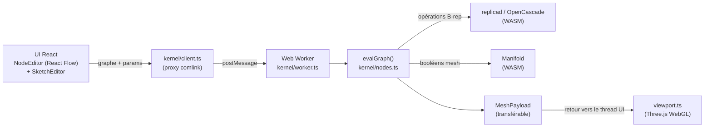

# nodal-maker — Architecture & fonctionnement

Un outil de CAO/FAO paramétrique nodal pour le navigateur, orienté **impression 3D résine**
et **découpe laser / Cricut**. On câble des nœuds en un graphe (Fusion360 rencontre
Blender), on ajuste des paramètres, et on obtient en direct des solides B-rep et des profils
2D exportables en STL / STEP / 3MF / SVG / DXF.

Ce document est la visite de référence du code : les briques, le flux de données, les deux
moteurs géométriques, le solver de contraintes, le viewport, et la chaîne build/deploy/tests.
Objectif : rendre un nouveau contributeur productif rapidement.

---

## 1. En bref — la forme générale



- **Toute la géométrie tourne dans un Web Worker** : l'UI ne bloque jamais sur OpenCascade.
- **Deux moteurs géométriques** cohabitent : **replicad** (OpenCascade / B-rep, exact) pour
  l'essentiel de la modélisation, et **Manifold** (mesh garanti manifold) pour les booléens
  robustes, enveloppes, infill gyroïde, etc.
- Le graphe est **caché en content-addressed** : changer un paramètre ne recalcule que ce
  nœud et ses descendants.
- Le **sketcher 2D à contraintes** est un petit module sans framework, partagé par l'UI et
  le kernel, résolu par **Levenberg–Marquardt**.

---

## 2. Stack technique

| Couche | Choix |
|---|---|
| Langage | TypeScript (strict, ESM) |
| UI | React 18 + [@xyflow/react](https://reactflow.dev) (React Flow) pour le canvas de nœuds |
| Viewport 3D | Three.js (WebGLRenderer, OrbitControls, TransformControls) |
| Kernel B-rep | [replicad](https://replicad.xyz) → OpenCascade.js (WASM) |
| Kernel mesh | [Manifold](https://github.com/elalish/manifold) (WASM) |
| Pont vers le worker | [comlink](https://github.com/GoogleChromeLabs/comlink) |
| Polices / texte | opentype.js |
| Build | Vite |
| Tests | Vitest |
| Vignettes | Playwright (screenshot WebGL headless) |
| Déploiement | GitHub Actions → GitHub Pages |

Pas de backend — une SPA entièrement statique. Les deux kernels WASM se chargent
paresseusement dans le worker.

---

## 3. Carte des répertoires

```
src/
  main.tsx              point d'entrée ; monte <App> (ou le harnais de vignettes sur ?thumbs)
  App.tsx               coquille de haut niveau : viewport + barre d'outils + panneaux, câble UI↔worker
  NodeEditor.tsx        le canvas de nœuds React Flow, la palette, les modes Simple/Expert
  SketchEditor.tsx      l'overlay d'esquisse 2D à contraintes
  ThumbHarness.tsx      harnais hors-app qui rend un exemple → PNG (pour les vignettes)
  viewport.ts           scène Three.js : ombrage, picking, gizmos, coupe, analyses
  massprops.ts          volume / aire / bbox / centroïde + contrôle watertight (pur JS)
  export3mf.ts          écriture 3MF minimale (OPC/ZIP)

  kernel/
    client.ts           proxy comlink vers le worker + réexport des métadonnées
    worker.ts           le Web Worker : boote les deux kernels WASM, expose l'API
    nodes.ts            ★ le cœur : REGISTRY des nœuds, types GraphValue, evalGraph, cache
    specs.ts            métadonnées côté UI : NODE_SPECS, catégories, couleurs de sockets (sans WASM)
    model.ts            graphe → MeshPayload affichable ; exporteurs SVG/DXF
    manifold.ts         wrapper Manifold : booléens mesh, enveloppe, minkowski, decimate…
    components.ts       expansion des « composants » (sous-graphes réutilisables)
    expr.ts             l'évaluateur d'expressions (paramètres du type `width/2 + 4`)
    marchingCubes.ts    extraction d'isosurface (utilisée par l'infill gyroïde)
    dxfImport.ts        lecteur DXF minimal → Drawing replicad
    svgPath.ts          chemin SVG `d` → Drawing replicad
    stl.ts              lecture/écriture STL binaire

  sketch/               le sketcher 2D à contraintes (sans framework, partagé UI↔kernel)
    model.ts            modèle de données SketchDoc (points, entités, contraintes)
    solver.ts           solver de contraintes Levenberg–Marquardt
    build.ts            SketchDoc résolu → Drawing replicad
    geometry.ts         helpers de géométrie 2D
    trim.ts             opérations d'édition trim / split / congé-de-coin
    presets.ts          documents de départ (rectangle, plaque-à-trou, …)

scripts/                outillage build-time (vignettes, génération de scènes, smoke tests)
test/                   suite Vitest (éval kernel, expr, mass props, solver, exports…)
examples/*.json         55 projets d'exemple (format SceneDoc)
public/thumbs/*.png     une vignette rendue WebGL par exemple
```

---

## 4. Le graphe de nœuds — concepts de base

Tout ce que l'utilisateur construit est un **graphe de nœuds typés**. Ça vit dans
`kernel/nodes.ts`.

### 4.1 Les valeurs circulent sur les fils (typées)

Les fils transportent une `GraphValue`, une union discriminée :

```ts
type GraphValue =
  | { kind: "sketch2d"; drawing: Drawing; plane?; planeOffset?; frame? }  // profil 2D (violet)
  | { kind: "solid";    solid: Shape3D; color? }                          // solide B-rep (orange→gris)
  | { kind: "mesh";     mesh: MeshData }                                   // mesh triangulé (cyan)
  | { kind: "number";   value: number }                                   // scalaire (vert)
  | { kind: "text";     value: string }                                   // chaîne (jaune)
  | { kind: "selection"; target: "edge" | "face"; apply: (finder) => … }  // critères (ambre)
```

Les **couleurs** de sockets dans la palette et sur les ports viennent directement de ces
`kind` (`SOCKET_COLORS` dans `specs.ts`) — la pastille de sortie d'un nœud indique quelles
entrées il peut alimenter.

### 4.2 Deux tables parallèles

- **`NODE_SPECS`** (`specs.ts`) — métadonnées pures : label, entrées, type de sortie,
  paramètres. Importé par l'**UI** *sans dépendance WASM* (garde le bundle UI léger).
- **`REGISTRY`** (`nodes.ts`) — les implémentations : `(inputs, params) => GraphValue`.
  Importé par le **worker**, où OpenCascade/Manifold sont disponibles.

Ajouter un nœud = une entrée dans chaque table (+ une catégorie + une description). Voir §12.

### 4.3 Évaluation — topologique, mémoïsée, content-addressed

`evalGraph(graph, vars)` parcourt le DAG paresseusement depuis la sortie demandée :

1. `resolveRef` récupère chaque valeur d'entrée (en remontant les nœuds amont, mémoïsé par
   run).
2. `resolveInputs` fusionne les entrées câblées par-dessus les paramètres, en convertissant
   les **paramètres numériques qui sont des expressions** (ex. `"width/2"`) via `expr.ts` et
   la map des paramètres utilisateur `vars`.
3. L'impl `REGISTRY` du nœud s'exécute ; les échecs sont enveloppés par **`humanizeError`**
   (transforme les aborts cryptiques d'OpenCascade en « rayon de congé trop grand », etc.)
   et taggés avec l'id du nœud pour que l'éditeur puisse le surligner.

**Cache incrémental** (`evalGraphCached`, `EvalCache`) : chaque nœud reçoit un **hash de
contenu** (`fnv1a` de `type + params + les hashs de ses entrées` + la clé des vars
utilisateur). Changer un paramètre ne change que le hash de ce nœud — et de ses descendants ;
tout le reste est servi depuis le cache. Un compteur `run` pilote une fenêtre de rétention
qui écarte les entrées périmées.

### 4.4 Les sélections (face / arête) survivent à la régénération

Le congé/coque/chanfrein ne stocke pas d'indices de faces (qui changent quand la géométrie
est régénérée). À la place, un nœud **Face/Edge Select** émet une valeur `selection` : une
*closure de critères* (`inPlane`, `parallelTo`, `top`, `cylindrical`, …) appliquée au solide
que reçoit l'opération aval. `forwardCrit` re-mappe même une sélection à travers un transform
pour qu'une « face du dessus » reste la face du dessus après un déplacement. C'est ce qui
fait marcher le picking-dans-le-viewport → câblage-auto d'un nœud Face Select.

### 4.5 Expressions & paramètres utilisateur (`expr.ts`)

Un petit évaluateur en descente récursive (sans `eval`) avec une grammaire term→unary→power
pour que `-2^2 = -4`. Gère `+ - * / ^ %`, des fonctions (`sqrt`, `sin/cos`, `sind/cosd`,
`min`, `max`, `hypot`, `atan2`, …) et des constantes (`pi`, `tau`, `e`). Les **paramètres
utilisateur** globaux (le panneau `ƒ`) se résolvent dans l'ordre en une map `vars` que tout
champ numérique peut référencer.

---

## 5. Les deux moteurs géométriques

Les deux bootent paresseusement dans le worker (`worker.ts` → `ensureKernels()`) ; le thread
UI ne touche jamais au WASM.

### 5.1 replicad / OpenCascade — le kernel B-rep (exact)

L'essentiel de la modélisation est en **représentation par frontières** (surfaces
NURBS/analytiques exactes) : box, cylindre, extrusion, révolution, loft, sweep, congé,
chanfrein, coque, poche, perçage, booléen, filetage… `nodes.ts` appelle l'API fluide de
replicad (`draw…`, `sketchOnPlane`, `.extrude`, `.fuse/.cut/.intersect`, `.fillet`,
`.shell`). Le B-rep est ce qui permet l'export STEP et des arêtes propres. Le maillage pour
l'affichage passe par `meshAndTag()` (→ `MeshPayload`), qui tagge aussi chaque groupe de
triangles en `top/side/bottom` (utilisé pour le picking).

### 5.2 Manifold — le kernel mesh (robuste)

Quand l'exactitude n'est pas nécessaire mais que la **robustesse** l'est, la géométrie
descend en `MeshData` (`{vertices, indices}`) et utilise Manifold (`kernel/manifold.ts`) :
booléens mesh (garantis manifold, sans la fragilité des booléens OCCT), enveloppe convexe,
somme de Minkowski, decimate, subdivide, et les nœuds **collision** et **gyroïde**.
`solidToMeshData` / `meshToSolid` font le pont entre les deux domaines.

### 5.3 La frontière Web Worker

`client.ts` enveloppe le worker avec comlink pour que l'UI appelle `kernel.evalGraph(...)`
comme si c'était local. Le `MeshPayload` est construit à partir de tableaux typés
transférables. Le même `nodes.ts` tourne dans Node pour les **tests** et les **scripts de
scènes/vignettes** (qui appellent `setOC`/`setManifold` manuellement, à l'image de
`ensureKernels`).

---

## 6. Le sketcher 2D à contraintes (`src/sketch/`)

Un module autonome, sans framework (ni React, ni replicad) pour que le même code exact
tourne dans l'overlay UI et dans le kernel.

- **`model.ts`** — `SketchDoc` : `points`, `entities` (ligne / arc / cercle), `constraints`
  (coïncidence, horizontal, vertical, parallèle, perpendiculaire, égal, tangent, pointOn,
  midpoint, symétrique, fixé) et **dimensions** (distance / rayon / angle) qui portent une
  valeur directrice. Plus un `plane` de base (XY/XZ/YZ) + offset, ou un `frame` arbitraire
  (origine/normale/xDir) pour l'*esquisse-sur-face-inclinée*.
- **`solver.ts`** — minimise ‖r(x)‖² sur les coordonnées libres (x/y des points + rayons des
  cercles) par **Levenberg–Marquardt**, avec un **Jacobien numérique** et une petite
  résolution linéaire dense. Les esquisses sont minuscules, donc c'est instantané. Les pins
  (points fixés) et les **overrides** de dimensions (venant des params de nœud) entrent ici,
  c'est ainsi qu'éditer une cote re-résout en direct.
- **`build.ts`** — transforme un doc *résolu* en `Drawing` replicad (le profil que
  consomment extrude/pocket/revolve).
- **`trim.ts`** — éditions interactives : trim, split-au-clic, congé-de-coin (arc tangent).

Le nœud `sketch` stocke son `SketchDoc` dans ses params, reflète chaque dimension comme un
champ de nœud éditable, et re-résout à chaque changement.

---

## 7. Le viewport (`viewport.ts`, Three.js)

Un seul `WebGLRenderer` (antialias, `preserveDrawingBuffer` pour les captures,
`localClipping`).

- **Ombrage** — un unique matériau de corps **gris** neutre (look Fusion) ; le mesh n'est
  découpé en groupes `top/side/bottom` que pour permettre au **picking** d'identifier les
  faces. Un nœud **Color** peut surcharger la teinte du corps entier. Une esquisse 2D est
  rendue comme une **face plate remplie** (double-face, violet translucide) + son contour —
  aucune fausse épaisseur.
- **Modes d'affichage** — shaded / **edges** (défaut : ombré + vraies arêtes de construction
  B-rep) / wireframe.
- **Picking** — raycasts pour `pickFace`, `pickEdge`, `pickBorder`, `pickFacePlane` (plan
  incliné quelconque), `pickPoint` (pour l'outil Mesure). Un clic câble automatiquement le
  nœud Face/Edge Select correspondant.
- **Gizmos** — TransformControls liés à un nœud Transform/Rotate/Scale réécrit ses params en
  direct.
- **Overlays d'analyse** — passes de couleurs par vertex pour les **surplombs** (faces
  tournées vers le bas plus raides qu'un angle) et l'**épaisseur de paroi** (raycast interne
  vers la paroi opposée).
- **Coupe** — un plan de clipping le long d'un axe.
- **Mesure** — annotations de distance persistantes (ligne + marqueurs d'extrémités + une
  étiquette sprite-canvas).
- **Turntable** — enregistre un WebM en faisant tourner la caméra et en poussant les frames
  via `captureStream` + `MediaRecorder`.

---

## 8. L'UI (`NodeEditor.tsx`, `App.tsx`)

- **`App.tsx`** — la coquille : monte le viewport, débounce les changements de graphe vers
  `kernel.evalGraph`, pousse le `MeshPayload` résultant dans le viewport, et héberge la
  barre d'outils (modes de picking, mode d'affichage, Analyze, Props, Section, Turntable) +
  le panneau Props (volume/aire/bbox/centroïde, contrôle **watertight**, estimation
  coût/temps résine).
- **`NodeEditor.tsx`** — le canvas React Flow : la palette (catégorisée, pastillée par type
  de sortie), les corps de nœuds avec champs de params inline, l'accordéon des sorties de
  sélection, la timeline d'historique, l'ajout rapide, les composants (regrouper une
  sélection en un sous-graphe réutilisable), et la persistance en `localStorage`.

### 8.1 Modes Simple / Expert (le configurateur)

Deux onglets se posent au-dessus de l'éditeur :

- **Expert** = le graphe de nœuds complet. Chaque paramètre a une `☆` pour l'**exposer**.
- **Simple** = un formulaire propre : une **galerie de vignettes** d'exemples + uniquement
  les paramètres exposés (+ les paramètres globaux `ƒ`), rendus avec les mêmes contrôles
  `ParamField`, pour qu'un utilisateur non-nœuds ajuste juste des valeurs et regarde le
  modèle se mettre à jour. Les paramètres exposés + les paramètres utilisateur voyagent
  *dans le graphe sauvegardé* et dans les fichiers d'exemple, donc un auteur définit le
  formulaire Simple de son modèle. Simple est la vue **par défaut**.

---

## 9. Catalogue de fonctionnalités (catégories de nœuds)

| Catégorie | Nœuds (sélection) |
|---|---|
| **Value** | number, text, math, clamp, remap, random |
| **2D Primitive** | sketch, rect, circle, ellipse, polygon, star, slot, gear, finger-joint box, **living hinge**, SVG input, **import DXF**, text→SVG |
| **2D Op** | offset, kerf, fillet, bevel, boolean, mirror, transform, array (linéaire/radiale), **nest**, **dogbone**, **tabs (hold-in-sheet)**, group, score/cut |
| **3D Primitive** | box, cylinder, sphere, cone, torus, thread, internal thread, import STEP |
| **Sketch → Solid** | extrude (taper/twist), pocket, hole (counterbore/countersink), revolve, loft, loft-sections, sweep, boss-on-cap, **text on face** |
| **3D Op** | transform, rotate, scale, mirror, fillet (rayon variable), bevel, shell, **hollow (résine)**, **infill lattice**, **gyroïde**, **split**, **auto-orient**, **supports**, boolean, **collision**, **color**, assemble, array (linéaire/radiale/**sur chemin**) |
| **Selector** | edge select, face select |
| **Mesh** | tessellate, mesh→solid, import STL, repair, boolean, transform, convex hull, minkowski, decimate, subdivide |

L'analyse impression/laser vit dans la barre d'outils du viewport (surplombs, épaisseur de
paroi, coupe, mesure) et le panneau Props (watertight, coût/temps résine).

---

## 10. Export & import

| Format | Chemin | Notes |
|---|---|---|
| **STL** (binaire) | `kernel/stl.ts` | mesh en entrée/sortie |
| **STEP** | replicad | B-rep exact, solides uniquement |
| **3MF** | `export3mf.ts` | OPC/ZIP fait main (store-only + CRC-32) |
| **SVG** | `model.ts` `exportGraphSVG` | profils 2D |
| **DXF** | `model.ts` `exportGraphDXF` + `dxfImport.ts` | calques CUT/SCORE ; import LINE/ARC/CIRCLE/LWPOLYLINE |
| **PNG** | viewport `snapshotPNG` | rendu fixe |
| **WebM** | turntable viewport | vidéo tournante |

---

## 11. Pipeline de vignettes

Chaque exemple obtient un **vrai screenshot WebGL** (pas un faux SVG isométrique) :

1. `?thumbs` monte **`ThumbHarness`** au lieu de `<App>` — un viewport de taille fixe qui
   expose `window.__thumb.shoot(name)`.
2. **`scripts/shoot-thumbs.ts`** lance un serveur de dev Vite, ouvre le harnais dans un
   Chromium headless (WebGL SwiftShader), et pour chaque exemple *manquant* le charge, le
   cadre, **supersample 720→256px**, et écrit `public/thumbs/<name>.png`.
3. C'est **manquantes seulement** par défaut (no-op rapide quand tout est commité) et le
   navigateur n'est jamais booté s'il n'y a rien à faire. Lancer `npm run thumbs:examples`
   (ou `:force`).

La CI de déploiement le lance aussi, pour qu'un exemple fraîchement ajouté obtienne une
vignette sans pré-rendu local.

---

## 12. L'étendre — ajouter un nœud en 4 éditions

1. **`kernel/specs.ts`** — une entrée `NODE_SPECS` (label, entrées, sortie, params), une
   ligne dans `NODE_CATEGORIES`, et un texte `NODE_DESCRIPTIONS`.
2. **`kernel/nodes.ts`** — une impl `REGISTRY` : `(inputs, params) => GraphValue`. Utilise
   `expectSolid/expectSketch/expectMesh/asMeshData` pour lire les entrées.
3. S'il a besoin de cibler des faces/arêtes, émets ou consomme une `selection`.
4. Ajoute un test dans `test/nodes.test.ts`.

C'est tout — la palette, le câblage, le cache, l'exposition en mode Simple et l'export
marchent automatiquement, car ils sont pilotés par les specs + les `kind` de valeurs.

---

## 13. Build, tests, déploiement

| Commande | Rôle |
|---|---|
| `npm run dev` | serveur de dev Vite |
| `npm run build` | typecheck (`tsc -b`) + build Vite |
| `npm test` / `test:watch` | suite Vitest (éval kernel, expr, mass props, solver, exports) |
| `npm run thumbs:examples` | (re)génère les vignettes d'exemples manquantes |
| `npm run scenes` | rend les scènes livrées (smoke test) |

**CI** (`.github/workflows/deploy.yml`) au push sur `main` : `npm ci` → **`npm test`
(conditionne le déploiement)** → install de Chromium Playwright (caché) → génération des
vignettes manquantes → `npm run build` → publication de `dist/` sur **GitHub Pages**. La
suite Vitest boote les deux kernels WASM dans Node exactement comme l'app.

---

## 14. Décisions de design & limites connues

- **Deux kernels, volontairement.** B-rep pour l'exactitude/STEP/arêtes propres ; Manifold
  pour les booléens robustes et le travail sur surfaces implicites (gyroïde). Le pont coûte
  une tessellation mais achète la fiabilité.
- **Pas d'offset de solide dans OpenCascade** → le *thicken* n'est pas proposé ; le draft se
  fait plutôt via le taper d'extrusion.
- **Le volume d'une coque creuse** n'est pas fiable via `meshMassProps` (winding des parois
  internes), donc les contrôles watertight/volume traitent les coques en conséquence.
- **Le gyroïde** ne sort que les parois d'infill clippées ; unis ta propre coque via un
  booléen mesh si tu veux une peau (l'union de coque était fragile).
- **Le turntable** repose sur l'encodage vidéo `MediaRecorder`, désactivé dans certains
  navigateurs headless/automatisés (repli sur un avertissement clair, jamais un fichier de
  0 octet).
- L'approche **vignettes SVG-dans-le-bundle** a été remplacée par des fichiers PNG chargés
  paresseusement, pour garder le bundle JS léger à mesure que la bibliothèque grandit.

---

*Document vivant. Quand tu ajoutes un sous-système, ajoute une section ici.*
